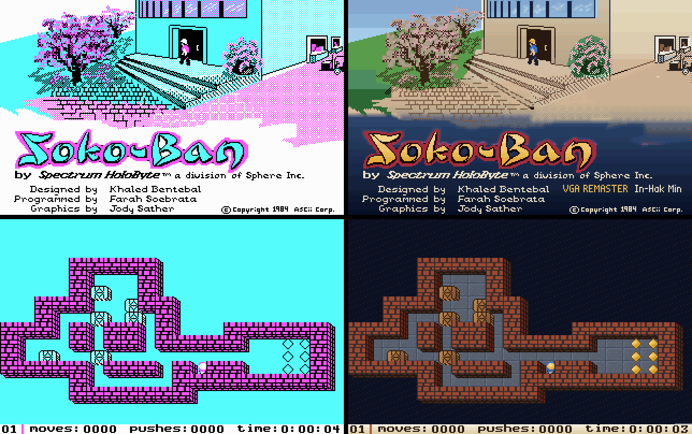
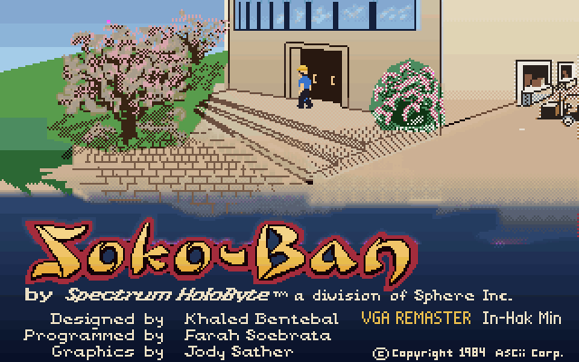
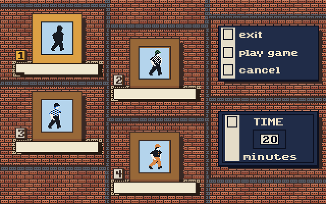
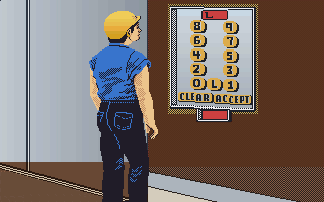
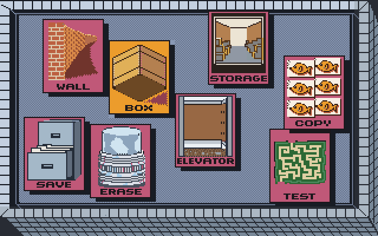

# SOKO-BAN (Spectrum HoloByte, 1988) — 역어셈블 → C → VGA 256색

원판 `SKB.EXE`(IBM CGA 판, 손으로 짠 8086 어셈블리 188 KB)를 기계적으로 C 로 옮기고,
같은 게임 코드에 256색 그림과 애드립 음악을 입힌 개선판을 더한 것이다.
글자는 원판 영어 그대로 둔다.

| 만든 것 | 무엇 |
|---|---|
| `SOKOBAN.EXE` | 원판을 그대로 옮긴 것. CGA 모드 4 / Tandy 모드 9 화면을 VGA 13h 로 보인다 |
| `SOKOVGA.EXE` | 같은 게임 코드 + 256색 그림 (`SKBVGA.DAT`) + 애드립 음악 (`SOUND.DAT`) |



*왼쪽이 원판 그대로(CGA 네 색), 오른쪽이 256색 개선판 — 같은 게임 코드가 그린 같은 화면이다.*

두 판 모두 `CWSDPMI.EXE` 와 원판 자료 파일(`INTRO1`, `LOBBY11`, `TAB*`, `ICON_DAT` …)이
같은 폴더에 있어야 한다. 바로 쓸 수 있게 묶은 것은 `release/` 에 있다.

```
release\SOKOVGA\SOKOVGA.EXE    256색 개선판
release\SOKOBAN\SOKOBAN.EXE    원판 그대로
```

### 화면

| | |
|---|---|
|  |  |
|  |  |

로비에서 EXIT / EDIT / PLAY 엘리베이터를 고르고, 엘리베이터 안에서 층 번호를 누르면
그 번호의 판이 열린다. 1~50 은 원판 단계, 51~99 는 편집기로 만드는 단계다.

## 원판 뜯어보기

* `SKB.EXE` 는 눌려 있지 않은 MZ 실행 파일이다. 코드 세그먼트 하나에 손으로 짠 어셈블리
  14,700 여 명령, 간접 점프가 없어 흐름을 끝까지 따라갈 수 있다.
* `tools/scan.py` 가 진입점에서 흐름을 따라가 함수 63 개를 찾고, `tools/asm2c.py` 가
  명령을 하나씩 C 로 옮긴다. 레지스터는 전역 변수(`AX`, `DS_` …), 메모리는 1 MB 짜리
  평평한 배열 `M[]`, 되돌아갈 자리는 직접 쌓는다. 플래그는 쓰이는 곳에서만 계산한다.
* 이름은 `tools/names_parts/*.txt` 에 모아 두고 `tools/mknames.py` 가 `tools/names.txt`
  로 합친다. 번역기는 이 이름으로 함수 이름과 변수 이름(`skbvars.h`)을 붙인다.
  세그먼트 레지스터 값을 흐름 따라 추정해서, 같은 오프셋이라도 어느 세그먼트의
  변수인지 가려 이름을 붙인다.

### 맞는지 어떻게 확인하나

* `tools/emu.py` 가 unicorn 으로 원판 기계어를 그대로 돌리고, 옮긴 C 는
  `hosttest.exe` 로 돌린다. 둘의 **인터럽트마다의 레지스터와 메모리 CRC** 를 맞대어 본다
  (`tools/difftest.py`).
* `test/k_*.txt` 는 자판 입력 시나리오다. `tools/regress.sh` 가 각 시나리오를
  원판 빌드(CGA/Tandy)와 개선판 빌드로 돌려 모두 같은지 본다.
* DOSBox 로 실제 화면을 찍어 보는 것은 `tools/dosshot.py` 와 `test/*.txt`.

## 256색 개선판

게임 코드는 손대지 않는다. 원판은 CGA 네 색으로 B800 에 그리므로, 그 옆에
**색 그림자**(`COL[]`, 바이트마다 네 점의 팔레트 번호)를 나란히 둔다.

* 그림 파일을 풀 때(`load_pic`), 스프라이트를 찍을 때(마스크 블릿 갈고리),
  메모리를 옮길 때(`movs`) 색도 함께 따라간다. 색이 없는 점은 화면마다의 테마 색으로.
* 색은 미리 `tools/mkvga.py` 가 `SKBVGA.DAT` 로 구워 둔다. 칠하는 규칙은
  `tools/scenes.py`(화면 그림)와 `tools/sprites_art.py`(EXE 안의 스프라이트, 타일, 글꼴).
  원판이 점 무늬(디더)로 표현한 면은 한 면으로 묶어 고르게 칠한다.
* 개선판에만 있는 것: 엘리베이터 문이 열리고 닫히는 중간 동작과 로비에서 걷는 사람을
  시간으로 메워 부드럽게, 애드립(OPL2) 배경음악 세 곡(`SOUND.DAT`).

## 빌드

도스 판은 djgpp, 대조 시험판은 MSYS2 mingw gcc, 도구는 python(capstone, unicorn, PIL)을 쓴다.

```
python tools/mklist.py     listing.asm
python tools/mknames.py    tools/names.txt
python tools/asm2c.py      skbcode.c, skbcode.h, skbvars.h
python tools/mkdata.py     skbdata.c
python tools/mkvga.py      SKBVGA.DAT
python tools/mkmusic.py    SOUND.DAT
build.bat                  SOKOBAN.EXE, SOKOVGA.EXE  (djgpp)
sh build_host.sh           hosttest.exe, hostvga.exe (대조 시험용)
sh tools/regress.sh        회귀 시험
```

## 폴더

```
*.c *.h          옮긴 코드 (skbcode.c 등 생성물은 저장소에 없다)
tools/           역어셈블, 번역, 그림, 음악, 대조 시험 도구
tools/names_parts/  구간별로 붙인 함수와 변수 이름
test/            자판 입력 시나리오
release/         바로 돌릴 수 있게 묶은 것
shots/           화면 사진
```

원작은 1982년 일본 Thinking Rabbit 의 소코반이고, 이 판은 1988년 Spectrum HoloByte 가
낸 IBM PC 판이다. 원판 자료 파일과 실행 파일의 권리는 원저작자에게 있다.
